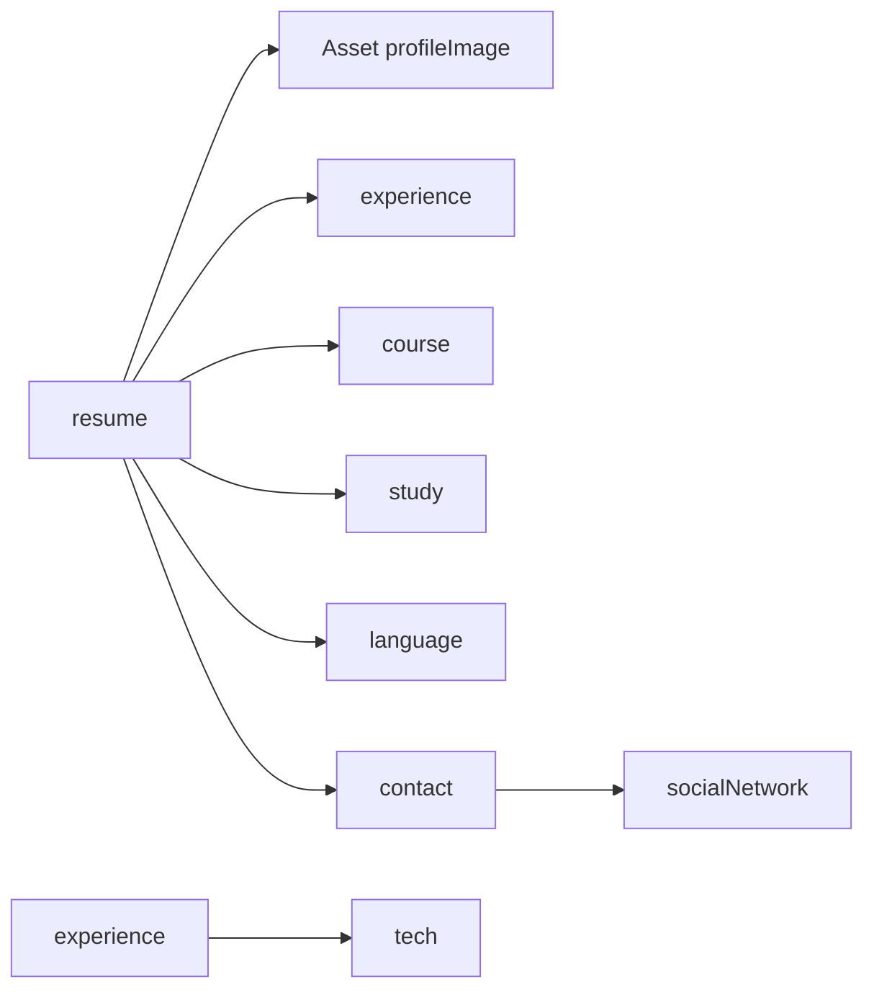

# HUB Content Model (AI / implementation reference)

This document is derived from `docs/hub-content-model.json` (Contentful Management export, normalized). Use it when implementing fetchers, serializers, or CMS tooling for the **HUB** space.

| Meta | Value |
|------|--------|
| Space key | `hub` |
| Space ID (example from export) | `cj2dsjkqo3qc` |
| Environment | `master` (from export; align with `CONTENTFUL_ENVIRONMENT`) |
| Content types | 8 |

**Regenerate source JSON**

```bash
node scripts/contentful/export-content-model.mjs --space hub
```

**Runtime clients (this repo)**

- Delivery + Management: `hubClients` in `lib/contentful/clients.ts` (`CONTENTFUL_SPACE_HUB_ID`, `CONTENTFUL_HUB_DELIVERY_TOKEN`, `CONTENTFUL_HUB_MANAGEMENT_TOKEN`, `CONTENTFUL_ENVIRONMENT`).
- Minimal Delivery helper: `hubFetchEntries` / `hubDeliveryGetEntries` in `lib/contentful/hub/hubService.ts`.

---

## Relationship overview

HUB models a personal site **resume** graph: a central `resume` entry links to supporting entries (`experience`, `course`, `study`, `language`, `contact`) and a **profile** asset. `contact` references `socialNetwork`. `experience` optionally references `tech`.



**Important:** In the current model, links from `resume` and `contact` / `experience` are **single Entry links** (not arrays). That implies either a **singleton composition** (one resume document pointing to at most one linked row per field) or a modeling limitation—see [Modeling review](#modeling-review).

---

## Content types

### `contact` — Contact

**Purpose:** Canonical contact block: public email plus a linked social profile aggregate.

**Display field:** `email`

| Field ID | API type | Required | Localized | Description (inferred) |
|----------|-----------|----------|-----------|-------------------------|
| `email` | `Symbol` | yes | no | Contact email; **unique** across entries. |
| `socialNetworks` | `Link` → Entry `socialNetwork` | yes | no | Single linked `socialNetwork` entry (see review). |

**Relationships**

- **Outgoing:** `socialNetworks` → `socialNetwork` (1:1 at field level).

---

### `socialNetwork` — Social Network

**Purpose:** One row per social presence (platform + URL + handle).

**Display field:** `platform`

| Field ID | API type | Required | Localized | Description (inferred) |
|----------|-----------|----------|-----------|-------------------------|
| `platform` | `Symbol` | yes | no | Platform name or key (e.g. GitHub, LinkedIn); **unique**. |
| `url` | `Symbol` | yes | no | Full profile URL; **unique**. |
| `username` | `Symbol` | yes | no | Handle or username; **unique**. |

**Relationships**

- **Incoming:** `contact.socialNetworks`.

---

### `tech` — Tech

**Purpose:** Reusable skill / technology label with English and Spanish names.

**Display field:** `nameEn`

| Field ID | API type | Required | Localized | Description (inferred) |
|----------|-----------|----------|-----------|-------------------------|
| `nameEn` | `Symbol` | yes | no | English label. |
| `nameEs` | `Symbol` | yes | no | Spanish label. |

**Relationships**

- **Incoming:** `experience.techs` (optional).

---

### `experience` — Experience

**Purpose:** Work history item: company, role, dates, bilingual descriptions, optional tech tag.

**Display field:** `roleEn`

| Field ID | API type | Required | Localized | Description (inferred) |
|----------|-----------|----------|-----------|-------------------------|
| `companyEn` / `companyEs` | `Symbol` | yes | no | Employer (bilingual pair). |
| `roleEn` / `roleEs` | `Symbol` | yes | no | Job title (bilingual). |
| `startDate` / `endDate` | `Date` | no | no | Employment window (open-ended if `endDate` empty). |
| `descriptionEn` / `descriptionEs` | `Text` | no | no | Longer role description. |
| `techs` | `Link` → Entry `tech` | no | no | Optional single linked tech (see review). |

**Relationships**

- **Outgoing:** `techs` → `tech` (0..1 per field definition).
- **Incoming:** `resume.workExperience`.

---

### `course` — Course

**Purpose:** Training / certification style entry (bilingual).

**Display field:** `titleEn`

| Field ID | API type | Required | Localized | Description (inferred) |
|----------|-----------|----------|-----------|-------------------------|
| `companyEn` / `companyEs` | `Symbol` | yes | no | Issuer or provider. |
| `titleEn` / `titleEs` | `Symbol` | yes | no | Course name. |
| `startDate` / `endDate` | `Date` | no | no | Optional period. |
| `descriptionEn` / `descriptionEs` | `Text` | yes | no | Course details. |

**Relationships**

- **Incoming:** `resume.courses`.

---

### `study` — Study

**Purpose:** Formal education entry (school, degree title, dates).

**Display field:** `titleEn`

| Field ID | API type | Required | Localized | Description (inferred) |
|----------|-----------|----------|-----------|-------------------------|
| `schoolEn` / `schoolEs` | `Symbol` | yes | no | Institution. |
| `titleEn` / `titleEs` | `Symbol` | yes | no | Degree or program title. |
| `startDate` | `Date` | no | no | Start (optional). |
| `endDate` | `Date` | **yes** | no | End or expected end (required—unlike `course`). |

**Relationships**

- **Incoming:** `resume.studies`.

---

### `language` — Language

**Purpose:** Language + proficiency, bilingual labels.

**Display field:** `nameEn`

| Field ID | API type | Required | Localized | Description (inferred) |
|----------|-----------|----------|-----------|-------------------------|
| `nameEn` | `Symbol` | yes | no | Language name (EN); **unique**. |
| `nameEs` | `Symbol` | yes | no | Language name (ES). |
| `levelEn` / `levelEs` | `Symbol` | yes | no | Level description (e.g. “Native”, “B2”). |

**Relationships**

- **Incoming:** `resume.languages`.

---

### `resume` — Resume

**Purpose:** Hub “root” document for the personal site: ties asset + CV sections + contact.

**Display field:** _none_ (set a display field in Contentful for better editorial UX).

| Field ID | API type | Required | Localized | Description (inferred) |
|----------|-----------|----------|-----------|-------------------------|
| `profileImage` | `Link` → **Asset** | yes | no | Portrait or avatar. |
| `workExperience` | `Link` → Entry `experience` | no | no | Linked experience row. |
| `courses` | `Link` → Entry `course` | no | no | Linked course row. |
| `studies` | `Link` → Entry `study` | no | no | Linked study row. |
| `languages` | `Link` → Entry `language` | no | no | Linked language row. |
| `contact` | `Link` → Entry `contact` | no | no | Linked contact row. |

**Relationships**

- **Outgoing:** Asset + entries as above.
- **Composition:** This type is the natural **entry point** for Delivery queries (`content_type=resume` with `include`).

---

## Delivery API — how to query

Never expose tokens in the browser; use server-side clients (e.g. `hubClients.deliveryClient`) or edge/server routes.

### Query parameters (REST)

Base URL pattern:

`GET https://cdn.contentful.com/spaces/{SPACE_ID}/environments/{ENVIRONMENT}/entries`

Common query string:

| Parameter | Example | Notes |
|-----------|---------|--------|
| `access_token` | _(Delivery API token)_ | Use `CONTENTFUL_HUB_DELIVERY_TOKEN` server-side. |
| `content_type` | `resume` | Filters by `sys.contentType.sys.id`. |
| `include` | `2` | Resolves linked entries (and assets) into `includes`. |
| `locale` | `en-US` | Must match a locale configured in the space. |
| `limit` | `10` | Default 100; max 1000. |

**Example (curl sketch)**

```bash
curl -sS "https://cdn.contentful.com/spaces/${CONTENTFUL_SPACE_HUB_ID}/environments/${CONTENTFUL_ENVIRONMENT}/entries?access_token=${CONTENTFUL_HUB_DELIVERY_TOKEN}&content_type=resume&include=2&limit=1"
```

### JavaScript SDK (aligned with this repo)

```ts
import { hubClients } from '@/lib/contentful/clients';

const res = await hubClients.deliveryClient.getEntries({
  content_type: 'resume',
  include: 2,
  limit: 1,
});

// Shallow list without resolves:
const { items, total } = await hubClients.deliveryClient.getEntries({
  content_type: 'experience',
  limit: 100,
  order: ['-sys.updatedAt'],
});
```

Same pattern as `hubDeliveryGetEntries` in `lib/contentful/hub/delivery.ts`, which sets `content_type`, `limit`, and `order`.

### GraphQL

If you add GraphQL later, map the same space/env/tokens; the **shape** differs (nested `items` / collections). This JSON export describes **REST field IDs** only.

---

## Delivery response shape (REST)

Top-level envelope:

```json
{
  "sys": { "type": "Array" },
  "total": 1,
  "skip": 0,
  "limit": 1,
  "items": [ /* Entry */ ],
  "includes": {
    "Entry": [ /* resolved entries by id */ ],
    "Asset": [ /* resolved assets by id */ ]
  }
}
```

**Entry item (abbreviated)**

```json
{
  "metadata": { "tags": [] },
  "sys": {
    "type": "Entry",
    "id": "…",
    "contentType": { "sys": { "type": "Link", "linkType": "ContentType", "id": "resume" } }
  },
  "fields": {
    "profileImage": { "en-US": { "sys": { "type": "Link", "linkType": "Asset", "id": "…" } } },
    "contact": { "en-US": { "sys": { "type": "Link", "linkType": "Entry", "id": "…" } } }
  }
}
```

**Rules for implementers**

1. **Locales:** Field values are nested under locale keys (e.g. `en-US`), even when the content type marks fields as `localized: false` in Management—Delivery still uses the space’s locale dictionary.
2. **Unresolved links:** If `include` is too low or the target is unpublished, links remain as `Link` objects without a matching `includes` entry.
3. **Deduping:** `includes.Entry` / `includes.Asset` are arrays; build a map by `sys.id` for O(1) joins.
4. **Publishing:** Delivery returns **published** snapshots only; draft content is Management-only.

---

## Modeling review

### Possible optimizations

- **Fewer API round-trips:** One `getEntries` on `resume` with `include: 2` (or deeper if you chain) instead of separate calls per content type—if the graph stays small.
- **CDN caching:** Public HUB content is a good fit for long `Cache-Control` on your origin or ISR in Next.js.
- **Field-level `localized: true`:** Replacing `*En` / `*Es` pairs with localized fields would shrink the schema and align with Contentful’s locale fallback—at the cost of a migration.

### Redundancies

- **Bilingual duplication:** `course`, `experience`, `study`, `language`, and `tech` duplicate English/Spanish as separate fields instead of localization. Editorial overhead and risk of mismatched pairs.
- **Parallel shapes:** `course` and `study` share a similar date/title pattern; could share a base pattern or documentation template for editors.

### Improvements (highest impact first)

1. **`resume` links as lists:** For a real CV you usually want **many** jobs, courses, etc. Consider changing `workExperience`, `courses`, `studies`, `languages` to **Array of Links** (or a “section” wrapper type) unless you intentionally enforce a single-row CV.
2. **`contact.socialNetworks`:** A single `Link` to one `socialNetwork` entry is restrictive; prefer **Array** of links to `socialNetwork` (or embed a small JSON-like structure if platforms are fixed—less ideal in Contentful).
3. **`experience.techs`:** Typically **many** technologies per role; use **Array** of links to `tech` (or a join type if you need per-role proficiency).
4. **`resume.displayField`:** Empty in export; setting it (e.g. to a title Symbol) improves CMS usability.
5. **Consistency:** `study.endDate` is required while `course.endDate` is optional—document the business rule or align requirements.
6. **Uniqueness:** `language.nameEn` is unique but `nameEs` is not—decide if both should be unique or neither, to avoid ambiguous Spanish labels.

---

## Quick reference — content type IDs

| ID | Name |
|----|------|
| `contact` | Contact |
| `course` | Course |
| `experience` | Experience |
| `language` | Language |
| `resume` | Resume |
| `socialNetwork` | Social Network |
| `study` | Study |
| `tech` | Tech |

When in doubt, re-export `docs/hub-content-model.json` and diff against this file’s **Meta** section.
